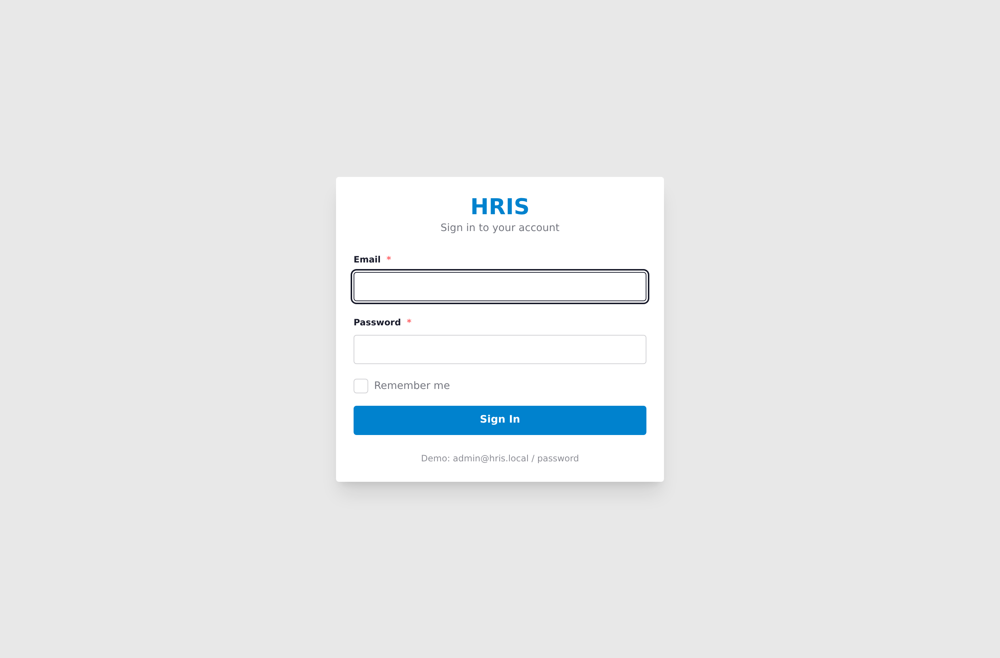
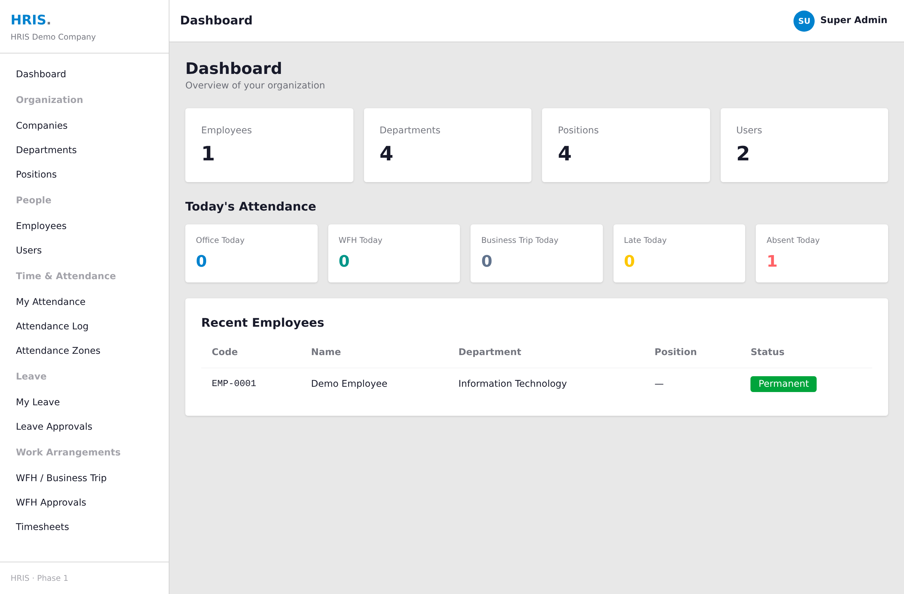
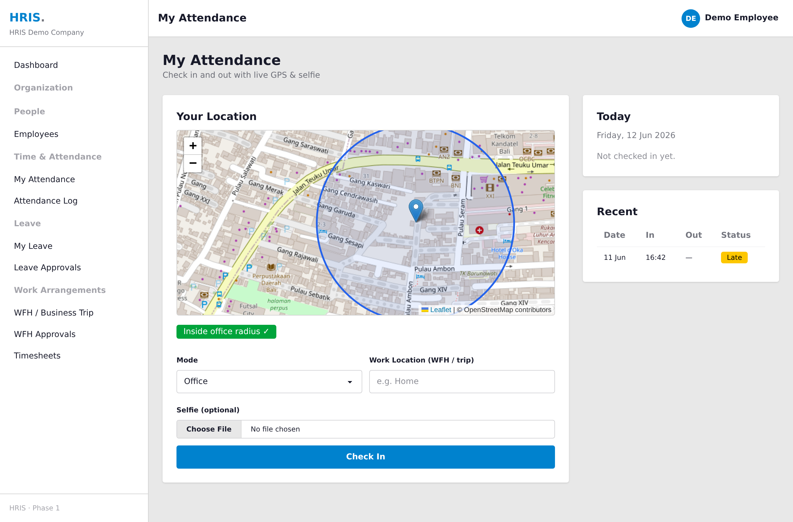
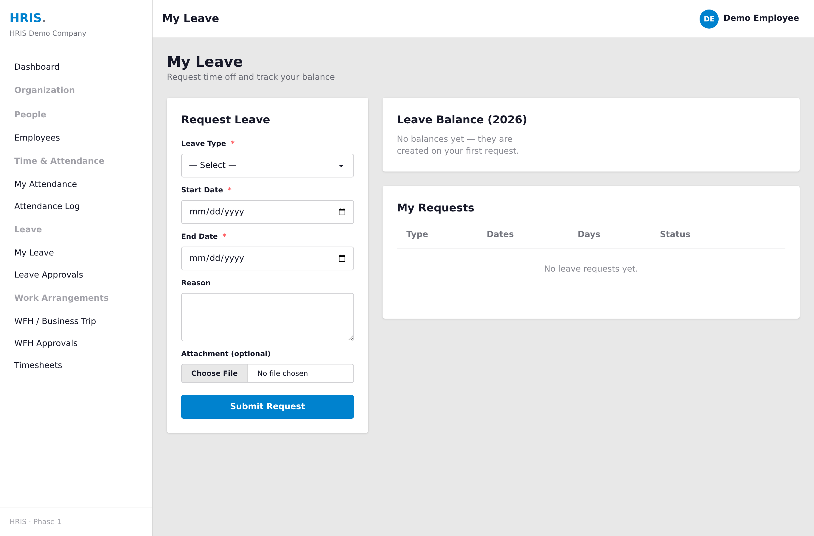
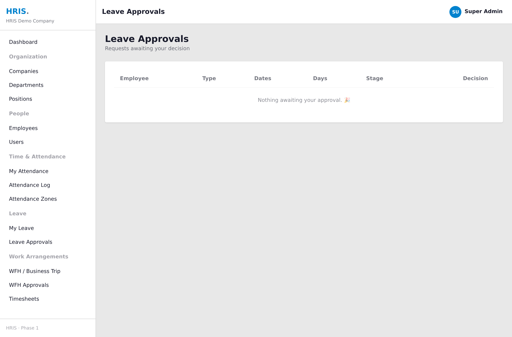
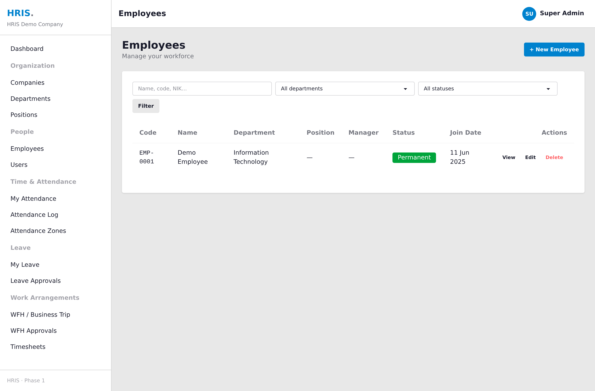
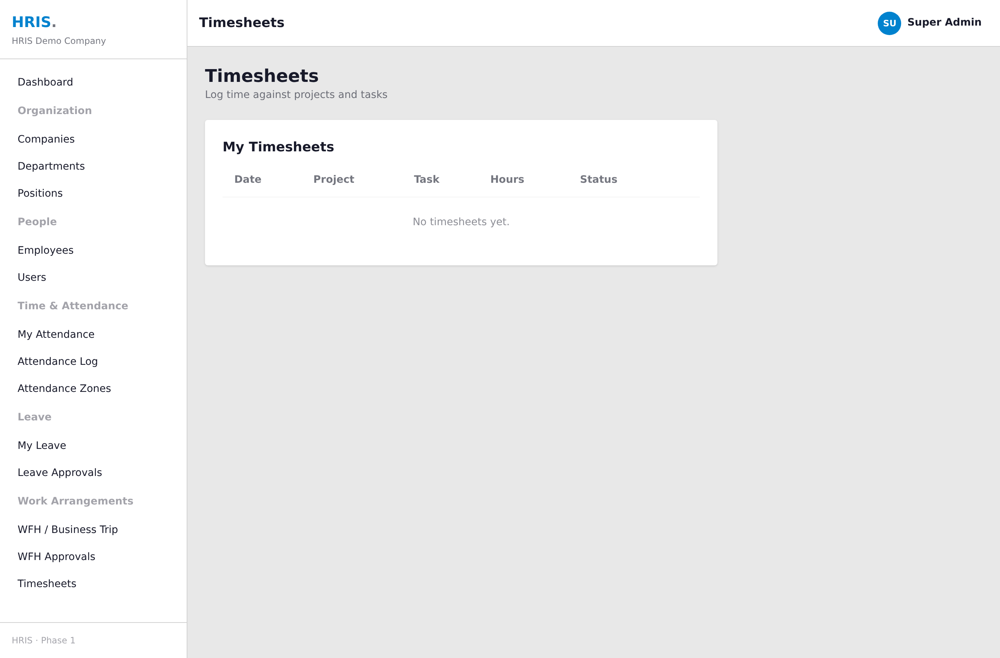

# HRIS — Human Resource Information System

<p align="center">
  
  
  
  
  
  
  
  
  
</p>

Aplikasi **HRIS (Human Resource Information System)** berbasis **Laravel 13** untuk mengelola data karyawan, absensi berbasis GPS/geofence, pengajuan cuti dengan alur persetujuan bertingkat, pengaturan kerja (WFH & perjalanan dinas), timesheet, dan log aktivitas harian — dilengkapi antarmuka web (Blade + Tailwind/DaisyUI) sekaligus **REST API** (Sanctum) untuk integrasi mobile/eksternal.

---

## Daftar Isi

1. [Screenshots](#screenshots)
2. [Fitur Utama](#fitur-utama)
3. [Tech Stack](#tech-stack)
4. [Arsitektur & Struktur Proyek](#arsitektur--struktur-proyek)
5. [Persyaratan Sistem](#persyaratan-sistem)
6. [Instalasi & Setup](#instalasi--setup)
7. [Menjalankan Aplikasi](#menjalankan-aplikasi)
8. [Akun Demo](#akun-demo)
9. [Peran & Hak Akses (Roles)](#peran--hak-akses-roles)
10. [Panduan Penggunaan per Fitur](#panduan-penggunaan-per-fitur)
11. [Dokumentasi REST API](#dokumentasi-rest-api)
12. [Skema Database](#skema-database)
13. [Testing](#testing)
14. [Troubleshooting](#troubleshooting)

---

## Screenshots

> Tangkapan layar disimpan di [`docs/screenshots/`](docs/screenshots/). Ganti berkas placeholder dengan screenshot asli Anda (lihat panduan nama berkas di folder tersebut).

| Login | Dashboard |
|:-----:|:---------:|
|  |  |

| Absensi & Geofence | Pengajuan Cuti |
|:------------------:|:--------------:|
|  |  |

| Persetujuan Cuti | Daftar Karyawan |
|:----------------:|:---------------:|
|  |  |

| Timesheet |
|:---------:|
|  |

---

## Fitur Utama

### 🏢 Manajemen Organisasi
- **Multi-perusahaan (multi-tenant)** — setiap data terisolasi per `company_id`.
- Manajemen **Perusahaan**, **Departemen**, dan **Jabatan (Position)**.
- Pengaturan **Shift kerja** (jam masuk, jam pulang, toleransi keterlambatan).

### 👥 Manajemen Karyawan
- Profil karyawan lengkap (kode karyawan, NIK, data pribadi, status kepegawaian, kontak).
- **Hierarki atasan–bawahan** (self-referential manager).
- Penyimpanan **alamat** dan **dokumen karyawan** (KTP, kontrak, sertifikat).
- Foto profil & penugasan shift.
- Status kepegawaian: *Permanent, Contract, Probation, Intern, Resigned*.

### 📍 Absensi & Geofence ⭐
- **Check-in / Check-out** dengan **lokasi GPS + foto** langsung dari perangkat.
- **Validasi Geofence**: absensi mode *Office* hanya valid jika berada dalam radius kantor (perhitungan Haversine). Mode *WFH* dan *Business Trip* melewati geofence.
- **Mode absensi**: Office, Work From Home (WFH), Business Trip.
- **Status absensi**: Present, Late, Leave, Absent, Holiday.
- Perhitungan **keterlambatan** otomatis (berdasarkan grace period shift) & **total jam kerja**.
- **Laporan absensi** dengan filter (karyawan, status, rentang tanggal).
- Manajemen **zona/lokasi absensi** (koordinat + radius).

### 🌴 Manajemen Cuti ⭐
- **Jenis cuti**: Annual, Sick, Maternity, Permission (dengan kuota tahunan).
- **Alur persetujuan dua tingkat**: Manager → HR (otomatis langsung ke HR jika karyawan tidak punya manager).
- **Saldo cuti** per jenis per tahun (entitled / used / sisa), dipotong otomatis saat disetujui HR.
- Dukungan **lampiran** (misal surat dokter untuk cuti sakit).
- **Notifikasi** otomatis ke approver & karyawan saat status berubah (termasuk channel WhatsApp opsional).
- Status: *Pending Manager → Pending HR → Approved / Rejected / Cancelled*.

### 🏠 Pengaturan Kerja (Work Arrangements)
- Pengajuan **WFH** dan **Perjalanan Dinas (Business Trip)** untuk tanggal tertentu.
- Alur persetujuan tunggal (Manager/HR).
- Status: *Pending, Approved, Rejected, Cancelled*.

### 📝 Log Kerja Harian & Timesheet
- **Daily Work Log** — pencatatan aktivitas/tugas selama WFH (tugas, deskripsi, waktu mulai–selesai).
- **Timesheet** berbasis proyek (tanggal, nama proyek, tugas, jam, catatan) dengan alur *Draft → Submitted → Approved/Rejected*.

### 🔐 Keamanan & Audit
- **Role-Based Access Control** via Spatie Permission (Super Admin, HR, Manager, Employee).
- **Policy** per resource untuk otorisasi granular.
- **Audit trail** lewat Spatie Activity Log (perubahan User, Company, Department, Position, EmployeeProfile).
- **Soft delete** pada entitas penting.

---

## Tech Stack

| Kategori | Teknologi |
|----------|-----------|
| Bahasa | PHP 8.3+ |
| Framework | Laravel 13.8+ |
| Autentikasi API | Laravel Sanctum 4 |
| Otorisasi | Spatie Laravel Permission 8 |
| Audit Log | Spatie Laravel Activity Log 5 |
| Frontend | Blade + Tailwind CSS 4 + DaisyUI 5 (tema `corporate`) |
| Build Tool | Vite 8 |
| Database | MySQL |
| Queue / Cache / Session | Database driver |
| Testing | PHPUnit 12 |
| Code Style | Laravel Pint |

---

## Arsitektur & Struktur Proyek

Aplikasi memakai pola **Service Layer + Repository + Policy + Form Request + Enum**.

```
app/
├── Models/                  # 16 model (User, Company, EmployeeProfile, Attendance, LeaveRequest, dll.)
├── Enums/                   # Status & tipe type-safe (AttendanceMode, LeaveStatus, dll.)
├── Http/
│   ├── Controllers/Web/     # Controller antarmuka web (Blade)
│   ├── Controllers/Api/     # Controller REST API (JSON)
│   └── Requests/            # Validasi Form Request
├── Services/                # Logika bisnis (AttendanceService, LeaveService, dll.)
├── Repositories/            # Abstraksi akses data (interface + implementasi)
├── Policies/                # Otorisasi per resource
└── Notifications/           # Notifikasi cuti (+ channel WhatsApp)
database/
├── migrations/              # 26 migrasi skema
├── seeders/                 # DatabaseSeeder, RolePermissionSeeder
└── factories/
resources/views/             # Template Blade + komponen UI
routes/
├── web.php                  # Rute antarmuka web
├── api.php                  # Rute REST API v1
└── console.php
```

Alur request umum: **Route → Controller → Form Request (validasi) → Service (logika bisnis) → Repository/Model → Response (Blade/JSON)**.

---

## Persyaratan Sistem

- PHP **8.3** atau lebih baru (dengan ekstensi standar Laravel)
- Composer 2
- Node.js 18+ & npm
- MySQL 8 (atau MariaDB)

---

## Instalasi & Setup

### Cara Cepat (otomatis)

Tersedia script `setup` di `composer.json` yang menjalankan instalasi, generate key, migrasi, dan build frontend:

```bash
composer run setup
```

> ⚠️ Script `setup` **tidak** menjalankan seeder. Jalankan seeder secara manual setelahnya (lihat langkah 6 di bawah) agar role, akun demo, dan data master tersedia.

### Cara Manual (langkah per langkah)

```bash
# 1. Clone & masuk direktori
git clone <repo-url> hris
cd hris

# 2. Install dependency PHP & JS
composer install
npm install

# 3. Siapkan file environment
cp .env.example .env
php artisan key:generate

# 4. Konfigurasi database di file .env
#    DB_CONNECTION=mysql
#    DB_HOST=127.0.0.1
#    DB_PORT=3306
#    DB_DATABASE=hris
#    DB_USERNAME=root
#    DB_PASSWORD=
#    (buat database kosong bernama `hris` terlebih dahulu)

# 5. Jalankan migrasi
php artisan migrate

# 6. Jalankan seeder (role, akun demo, data master)
php artisan db:seed

# 7. Buat symlink storage (untuk akses foto absensi & dokumen)
php artisan storage:link

# 8. Build aset frontend
npm run build
```

---

## Menjalankan Aplikasi

### Mode Development (semua proses sekaligus)

Menjalankan server, queue worker, log viewer (Pail), dan Vite secara paralel:

```bash
composer run dev
```

Lalu buka **http://localhost:8000**.

### Mode Manual (terminal terpisah)

```bash
php artisan serve          # server web → http://localhost:8000
npm run dev                # Vite dev server (hot reload)
php artisan queue:listen   # worker antrian (notifikasi, dll.)
```

> 💡 Karena `QUEUE_CONNECTION=database`, notifikasi cuti diproses lewat queue. Pastikan queue worker berjalan agar notifikasi terkirim.

---

## Akun Demo

Setelah `php artisan db:seed`, tersedia akun berikut (perusahaan: **HRIS Demo Company**):

| Peran | Email | Password |
|-------|-------|----------|
| Super Admin | `admin@hris.local` | `password` |
| Employee | `employee@hris.local` | `password` |

Data master yang ikut tersemai: departemen (HR, IT, FIN, MKT), jabatan, shift reguler (08:00–17:00, toleransi 15 menit), lokasi kantor (Head Office, radius 200 m), dan 4 jenis cuti.

---

## Peran & Hak Akses (Roles)

| Peran | Kemampuan |
|-------|-----------|
| **Super Admin** | Akses penuh ke seluruh sistem dan seluruh permission. |
| **HR** | Kelola karyawan, departemen, jabatan, akun user; persetujuan cuti & timesheet (tahap HR). |
| **Manager** | Visibilitas tim; menyetujui cuti/WFH bawahan (tahap manager). |
| **Employee** | Self-service: absensi, ajukan cuti/WFH, isi timesheet & work log. |

Permission mengikuti pola `{resource}.{ability}`, mis. `employee.create`, `leave.approve`, `company.view`.

---

## Panduan Penggunaan per Fitur

### Login
Buka `/login`, masuk dengan email & password. Setelah login akan diarahkan ke **Dashboard** yang menampilkan ringkasan (jumlah karyawan, departemen, jabatan, status absensi hari ini, jumlah WFH/perjalanan dinas).

### Mengelola Karyawan (HR / Admin)
1. Menu **Employees → Create**.
2. Isi data pribadi, departemen, jabatan, manager, dan shift.
3. Simpan, lalu buka detail karyawan untuk **mengunggah dokumen** (KTP, kontrak, dll.).

### Absensi (Karyawan)
1. Buka **Attendance → Me** (`/attendance/me`).
2. Pilih **mode** (Office / WFH / Business Trip).
3. Izinkan akses lokasi GPS — peta menampilkan posisi terhadap zona kantor.
4. Klik **Check-in** (ambil foto). Untuk mode Office, posisi harus berada dalam radius lokasi yang aktif.
5. Saat selesai, klik **Check-out**. Sistem menghitung total jam kerja & keterlambatan otomatis.

> HR/Manager dapat melihat seluruh log absensi di `/attendance` dengan filter karyawan/status/tanggal, serta mengatur zona lokasi di `/attendance-locations`.

### Pengajuan Cuti (Karyawan)
1. Buka **Leave → Me** (`/leave/me`) untuk melihat saldo & riwayat.
2. Klik **Ajukan Cuti**, pilih jenis cuti, tanggal mulai–selesai, alasan, dan lampiran bila wajib.
3. Status berubah menjadi *Pending Manager* (atau langsung *Pending HR* jika tanpa manager).
4. Pengajuan dapat **dibatalkan** selama belum final.

### Persetujuan Cuti (Manager / HR)
1. Buka **Leave Approvals** (`/leave/approvals`).
2. **Setujui** atau **Tolak** (dengan alasan). Setelah disetujui HR, saldo cuti otomatis terpotong dan karyawan menerima notifikasi.

### Pengaturan Kerja — WFH / Perjalanan Dinas
1. Karyawan: **Work Arrangements → Me** (`/work-arrangements/me`) → ajukan WFH/Business Trip untuk tanggal & alasan tertentu.
2. Approver: **Work Arrangements → Approvals** → setujui/tolak.

### Timesheet
1. Buka **Timesheets** → buat entri (tanggal, proyek, tugas, jam, catatan).
2. Klik **Submit** untuk dikirim ke approver.
3. Approver melakukan **Approve / Reject**.

---

## Dokumentasi REST API

Base URL: **`/api/v1`** — autentikasi memakai **Bearer Token (Sanctum)**.

### Autentikasi

```http
POST /api/v1/login          # body: { email, password } → mengembalikan token
GET  /api/v1/me             # data user aktif (perlu token)
POST /api/v1/logout         # cabut token aktif
```

Contoh login:

```bash
curl -X POST http://localhost:8000/api/v1/login \
  -H "Accept: application/json" \
  -d "email=admin@hris.local&password=password"
```

Gunakan token pada request selanjutnya:

```bash
curl http://localhost:8000/api/v1/me \
  -H "Accept: application/json" \
  -H "Authorization: Bearer <TOKEN>"
```

### Endpoint Utama

**Organisasi & Karyawan** (apiResource — index, store, show, update, destroy):

```http
GET|POST|PUT|DELETE  /api/v1/companies
GET|POST|PUT|DELETE  /api/v1/departments
GET|POST|PUT|DELETE  /api/v1/positions
GET|POST|PUT|DELETE  /api/v1/employees
POST                 /api/v1/employees/{id}/documents      # unggah dokumen
```

**Absensi:**

```http
GET   /api/v1/attendance              # daftar absensi
GET   /api/v1/attendance/today        # absensi hari ini
POST  /api/v1/attendance/check-in     # body: mode, latitude, longitude, photo
POST  /api/v1/attendance/check-out
```

**Cuti:**

```http
GET   /api/v1/leave-requests
POST  /api/v1/leave-requests
POST  /api/v1/leave-requests/{id}/approve
POST  /api/v1/leave-requests/{id}/reject
POST  /api/v1/leave-requests/{id}/cancel
GET   /api/v1/leave-balances          # saldo cuti tahun berjalan
```

**Pengaturan Kerja (WFH / Business Trip):**

```http
GET   /api/v1/attendance-requests
POST  /api/v1/attendance-requests
PUT   /api/v1/attendance-requests/{id}/approve
PUT   /api/v1/attendance-requests/{id}/reject
PUT   /api/v1/attendance-requests/{id}/cancel
```

**Daily Work Log & Timesheet:**

```http
GET   /api/v1/daily-work-logs
POST  /api/v1/daily-work-logs

GET   /api/v1/timesheets
POST  /api/v1/timesheets
PUT   /api/v1/timesheets/{id}/submit
PUT   /api/v1/timesheets/{id}/approve
PUT   /api/v1/timesheets/{id}/reject
```

---

## Skema Database

Entitas inti dan relasinya:

| Tabel | Keterangan |
|-------|-----------|
| `companies` | Perusahaan/tenant (nama, kontak, logo, paket langganan). |
| `users` | Akun login, terhubung ke perusahaan & role. |
| `departments` / `positions` | Struktur organisasi. |
| `shifts` | Shift kerja (jam + toleransi). |
| `employee_profiles` | Data inti karyawan; relasi ke user, departemen, jabatan, manager, shift. |
| `employee_addresses` / `employee_documents` | Alamat & dokumen karyawan. |
| `attendance_locations` | Zona absensi (koordinat + radius geofence). |
| `attendance` | Catatan check-in/out (GPS, foto, status, jam kerja, keterlambatan). |
| `attendance_requests` | Pengajuan WFH / perjalanan dinas. |
| `daily_work_logs` | Log aktivitas harian. |
| `timesheets` | Timesheet proyek dengan alur persetujuan. |
| `leave_types` | Jenis cuti + kuota tahunan. |
| `leave_requests` | Pengajuan cuti dengan persetujuan 2 tahap. |
| `leave_balances` | Saldo cuti per jenis per tahun. |
| Tabel Spatie | `roles`, `permissions`, `model_has_roles`, dll. |
| `activity_log` | Audit trail perubahan data. |

Status di-enkode lewat **PHP Enum** (`AttendanceMode`, `AttendanceStatus`, `LeaveStatus`, `RequestStatus`, `EmploymentStatus`, `TimesheetStatus`, dll.) untuk konsistensi tipe.

---

## Testing

```bash
# Jalankan seluruh test
php artisan test --compact

# Jalankan satu file
php artisan test --compact tests/Feature/ExampleTest.php

# Filter berdasarkan nama test
php artisan test --compact --filter=testName
```

Sebelum commit, jalankan formatter:

```bash
vendor/bin/pint --dirty
```

---

## Troubleshooting

| Masalah | Solusi |
|---------|--------|
| `Unable to locate file in Vite manifest` | Jalankan `npm run build` atau `npm run dev`. |
| Foto absensi / dokumen tidak tampil | Jalankan `php artisan storage:link`. |
| Notifikasi cuti tidak terkirim | Pastikan queue worker aktif: `php artisan queue:listen`. |
| Login gagal / role kosong | Pastikan `php artisan db:seed` sudah dijalankan. |
| Perubahan UI tidak muncul | Jalankan ulang `npm run dev` / `npm run build`. |

---

> Dibangun dengan Laravel 13 · Tailwind CSS 4 · DaisyUI · Sanctum · Spatie Permission
